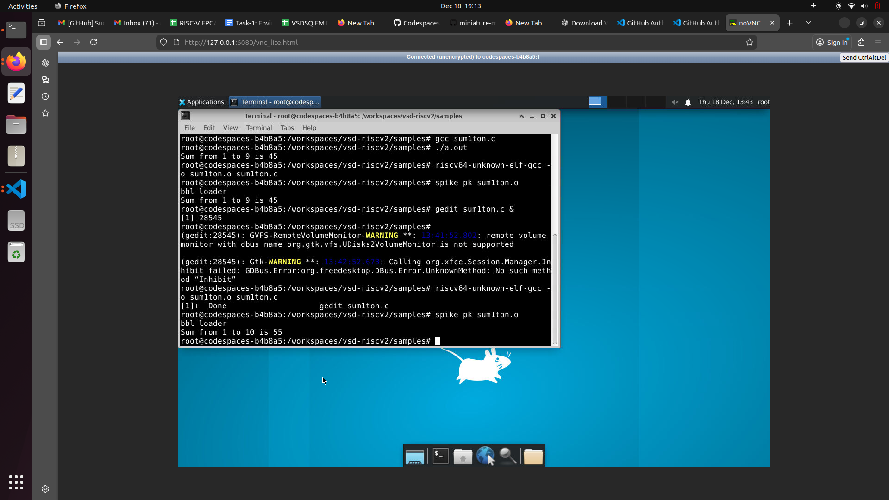
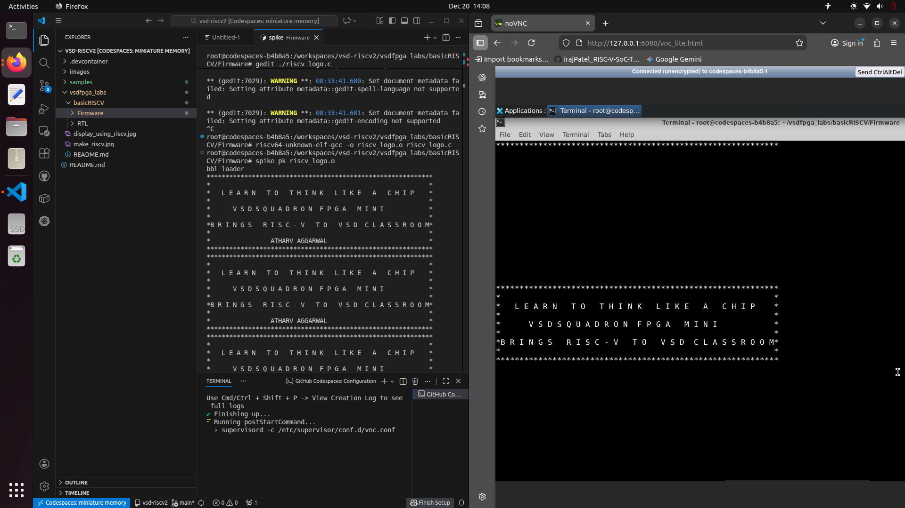

# FPGA-IP-DEVELOPMENT  
# Task-1: Environment Setup & RISC-V Reference Bring-Up

This repository contains the evidence and documentation for **Task-1**, demonstrating the successful setup, verification, and usage of the **RISC-V toolchain, simulators, and VSDFPGA firmware build flow** within a **GitHub Codespace (Linux)** environment.

The objective of this task was to validate a known-good RISC-V reference flow, ensure toolchain readiness, and prepare for upcoming RTL, IP, and FPGA integration tasks. No FPGA hardware was required or used for this task.

---

## Environment Used

- **Platform:** GitHub Codespace  
- **Operating System:** Linux  
- **Primary Interface:** VS Code Terminal inside Codespace  
- **Secondary Interface:** noVNC graphical terminal (Codespace)

All commands and builds were executed entirely inside the Codespace environment, as instructed.

---

## RISC-V Reference Program Execution

- **Repository:** `vsd-riscv2`  
- **Program Location:** `samples/`

### Commands Used

riscv64-unknown-elf-gcc --version  
iverilog -V  

riscv64-unknown-elf-gcc -o sum1ton.o sum1ton.c  
spike pk sum1ton.o  

### Output Observed

Sum from 1 to 9 is 45

### Screenshot Evidence

  
  

This confirms correct toolchain installation, successful compilation, ELF loading using Spike proxy kernel, and proper execution of the RISC-V program.

---

## Modified Program Execution (Optional Confidence Task)

The RISC-V program was modified to compute the sum from **1 to 10** instead of **1 to 9**, then rebuilt and re-executed.

### Commands Used

riscv64-unknown-elf-gcc -o sum1ton.o sum1ton.c  
spike pk sum1ton.o  

### Output Observed

Sum from 1 to 10 is 55

### Screenshot Evidence

This demonstrates the ability to modify source code, rebuild, and observe correct behavioral changes via simulation.

---

## VSDFPGA Firmware Build (No FPGA Hardware)

- **Repository:** `vsdfpga_labs`  
- **Lab:** `basicRISCV`  
- **Firmware Directory:** `basicRISCV/Firmware`

### Commands Used

git clone https://github.com/vsdip/vsdfpga_labs.git  
cd vsdfpga_labs/basicRISCV/Firmware  

make riscv_logo.bram.hex  

### Result

The firmware build completed successfully and generated the file:

riscv_logo.bram.hex

### Screenshot Evidence

FPGA flashing and physical hardware execution were intentionally skipped, as Task-1 requires only build and simulation-level validation.

---

## VSDFPGA RISC-V Logo Execution Using Spike (Simulator-Based)

In addition to HEX generation, the VSDFPGA firmware source (`riscv_logo.c`) was compiled into an ELF and executed using the Spike simulator.

### Commands Used

riscv64-unknown-elf-gcc -o riscv_logo.o riscv_logo.c  
spike pk riscv_logo.o  

### Output Observed

LEARN TO THINK LIKE A CHIP  
VSDSQUADRON FPGA MINI  
BRINGS RISC-V TO VSD CLASSROOM  

The firmware runs in an infinite loop and repeatedly prints the ASCII logo.

### Screenshot Evidence

In the screenshot:
- The **left side** shows execution in the **VS Code terminal**
- The **right side** shows the same output in the **noVNC graphical terminal**

On actual FPGA hardware, this output would appear over UART using `make terminal`. Hardware execution is intentionally out of scope for Task-1.

---

## Understanding Check

### 1. Where is the RISC-V program located?
The RISC-V reference program is located in the `samples` directory of the `vsd-riscv2` repository.

### 2. How is the program compiled and loaded into memory?
The program is cross-compiled using `riscv64-unknown-elf-gcc`. Execution is performed using the Spike simulator with the proxy kernel, which loads the ELF binary into simulated memory.

### 3. How does the RISC-V core access memory and memory-mapped IO?
The RISC-V core accesses memory and peripherals using standard load and store instructions. Memory-mapped IO allows peripherals to be accessed via specific address ranges.

### 4. Where would a new FPGA IP block logically integrate?
A new FPGA IP block would integrate as a memory-mapped peripheral connected to the SoC interconnect, allowing communication with the RISC-V core through standard load/store operations.

---

## Summary of Verification

The evidence provided in this repository confirms:

- **Environment Setup:**  
  RISC-V toolchain and simulators are correctly installed and configured.

- **Functional Simulation:**  
  Spike simulator successfully executes compiled RISC-V binaries.

- **Workflow Validation:**  
  Programs can be modified, recompiled, and re-executed correctly.

- **Firmware Generation:**  
  VSDFPGA firmware artifacts are built successfully without requiring FPGA hardware.

- **Firmware Execution Validation:**  
  VSDFPGA firmware behavior was validated through simulator-based execution using Spike, confirming correct ASCII logo generation without FPGA hardware.

This completes **Task-1: Environment Setup & RISC-V Reference Bring-Up**.
