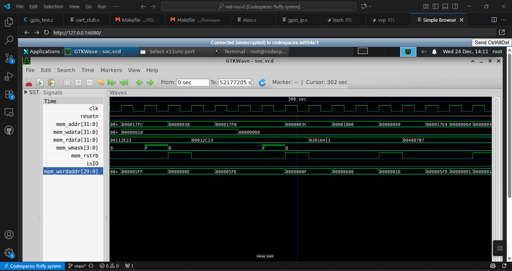
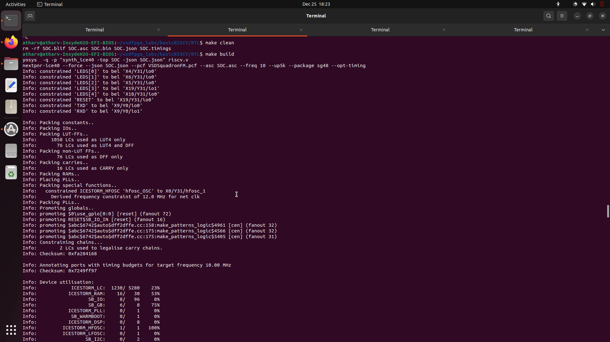
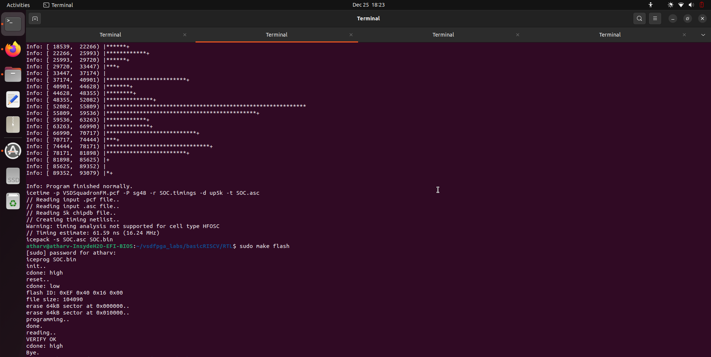

# RISC-V SoC GPIO Peripheral Integration (Task 2)

This repository documents the implementation of a **memory-mapped GPIO peripheral** integrated into a **minimal RISC-V SoC**, following the exact steps defined in **Task 2**.

The work is divided into **mandatory steps (1–4)** and an **optional hardware step (5)**. Simulation-based validation is the primary and required proof of correctness.

***

## 🔗 Quick Navigation

- [Step 1 – Understand the Existing SoC (Mandatory)](#step-1--understand-the-existing-soc-mandatory)
- [Step 2 – Write the GPIO IP RTL (Mandatory)](#step-2--write-the-gpio-ip-rtl-mandatory)
- [Step 3 – Integrate the GPIO IP into the SoC (Mandatory)](#step-3--integrate-the-gpio-ip-into-the-soc-mandatory)
- [Step 4 – Validate Using Simulation (Mandatory)](#step-4--validate-using-simulation-mandatory)
- [Step 5 – Hardware Validation (Optional)](#step-5--hardware-validation-optional)
- [Submission Summary](#submission-summary)

***

## Step 1 – Understand the Existing SoC (Mandatory)

This step focuses entirely on **reading and understanding the provided RISC-V SoC design**. No RTL modifications are made in this step.

The goal is to understand **how the CPU communicates with memory and peripherals**, and **where a new GPIO peripheral can be safely integrated later**.

### Objective of Step 1

By the end of this step, the following questions must be clearly answered:

- Where are **memory-mapped peripherals decoded**?
- How does the **CPU perform read and write operations**?
- How do **existing peripherals (LED, UART)** work?
- Which files are responsible for:
  - CPU execution
  - Memory
  - Peripheral decoding
  - SoC integration

This understanding forms the foundation for Steps 2–4.

### Project Structure Overview

The relevant files for Step 1 are located in:

```
basicRISCV/
├── RTL/
│   ├── riscv.v           ← Top-level SoC + CPU + Memory
│   ├── uart_sub.v    ← UART transmitter periphera
│   └── gpio_ip.v         ← (Added later, not used in Step 1)
│
├── Firmware/
│   ├── gpio_test.c            ← C test programs
│   ├── firmware.hex         ← Linker script
│   └── Makefile
```

For **Step 1**, the primary file of interest is **`RTL/riscv.v`**.

### Understanding the SoC Top-Level (`riscv.v`)

#### 1. The `SOC` Module

The `SOC` module is the **top-level integration point**. It connects:

- CPU
- RAM
- UART
- LED logic
- Clock and reset

This is where **all peripherals are wired together**.

Key signals exposed in the SoC:

```verilog
wire [31:0] mem_addr;
wire [31:0] mem_rdata;
wire        mem_rstrb;
wire [31:0] mem_wdata;
wire [3:0]  mem_wmask;
```

These signals form the CPU bus interface.

#### 2. CPU ↔ Bus Interface

Inside `riscv.v`, the CPU is instantiated as:

```verilog
Processor CPU (
    .clk        (clk),
    .resetn     (resetn),
    .mem_addr   (mem_addr),
    .mem_rdata  (mem_rdata),
    .mem_rstrb  (mem_rstrb),
    .mem_wdata  (mem_wdata),
    .mem_wmask  (mem_wmask)
);
```

From this, we learn the CPU does not know about peripherals. It only:

- Places an address on `mem_addr`
- Asserts read (`mem_rstrb`) or write (`mem_wmask`)
- Receives data via `mem_rdata`

All peripheral logic must respond to these signals.

### Memory and Address Decoding

#### 3. RAM Mapping

RAM is instantiated as:

```verilog
Memory RAM (
    .clk        (clk),
    .mem_addr   (mem_addr),
    .mem_rdata  (RAM_rdata),
    .mem_rstrb  (isRAM & mem_rstrb),
    .mem_wdata  (mem_wdata),
    .mem_wmask  ({4{isRAM}} & mem_wmask)
);
```

Address decoding logic:

```verilog
wire isIO  = mem_addr[22];
wire isRAM = !isIO;
```

**Key Learning:** Bit 22 of the address selects IO vs RAM.

- If `mem_addr[22] == 0` → RAM
- If `mem_addr[22] == 1` → IO (peripherals)

This is the primary decoding rule used throughout the SoC.

### Existing Memory-Mapped Peripherals

#### 4. Word-Aligned Peripheral Addressing

The SoC uses word-aligned addressing:

```verilog
wire [29:0] mem_wordaddr = mem_addr[31:2];
```

Peripherals are selected using 1-hot bits of `mem_wordaddr`.

Defined IO layout:

```verilog
localparam IO_LEDS_bit      = 0;
localparam IO_UART_DAT_bit  = 1;
localparam IO_UART_CNTL_bit = 2;
```

| Peripheral | Word Address Bit | Purpose            |
|------------|------------------|--------------------|
| LED        | bit 0            | Write LED register |
| UART TX    | bit 1            | Write UART data    |
| UART ST    | bit 2            | Read UART status   |

#### 5. LED Peripheral (Simple Register)

LED logic is implemented directly in SOC:

```verilog
always @(posedge clk) begin
    if (!resetn)
        LEDS <= 5'b0;
    else if (isIO & mem_wstrb & mem_wordaddr[IO_LEDS_bit])
        LEDS <= mem_wdata[4:0];
end
```

Key observations:

- LEDs are memory-mapped
- Written using `mem_wdata`
- Enabled by `isIO`, `mem_wstrb`, and address decode

This serves as a reference model for writing a GPIO peripheral.

#### 6. UART Peripheral

UART is instantiated as a separate module:

```verilog
corescore_emitter_uart UART (
    .i_clk     (clk),
    .i_rst     (!resetn),
    .i_data    (mem_wdata[7:0]),
    .i_valid   (uart_valid),
    .o_ready   (uart_ready),
    .o_uart_tx (TXD)
);
```

UART write enable logic:

```verilog
wire uart_valid = isIO & mem_wstrb & mem_wordaddr[IO_UART_DAT_bit];
```

UART readback (status):

```verilog
(mem_wordaddr[IO_UART_CNTL_bit]) ? {22'b0, !uart_ready, 9'b0} : ...
```

**Key Learning:** UART demonstrates both write-only and read-only registers, showing how `mem_rdata` is multiplexed for peripherals.

### How CPU Reads and Writes Registers

**Write Cycle Summary:**

- CPU sets `mem_addr`
- CPU sets `mem_wdata`
- CPU asserts `mem_wmask`
- SoC decodes address
- Selected peripheral captures data

**Read Cycle Summary:**

- CPU sets `mem_addr`
- CPU asserts `mem_rstrb`
- SoC selects peripheral
- Peripheral drives `mem_rdata`
- CPU reads value

This bus behavior is crucial for GPIO design in Step 2.

### Learnings from Step 1

After completing this step, the following are clearly understood:

- How memory-mapped IO works in the SoC
- How address decoding is implemented
- How peripherals are enabled and accessed
- How `mem_rdata` is multiplexed
- Where a new GPIO IP should be integrated
- Why correctness depends on matching the existing bus protocol

### Why Step 1 Is Mandatory

Step 1 ensures that:

- No incorrect assumptions are made about the bus
- New IPs follow the same protocol as existing peripherals
- Integration in Step 3 is clean and minimal
- Debugging in Step 4 is straightforward

No RTL is written in this step — only understanding.

Here's your text formatted in clean, GitHub-ready markdown:

***

# Step 2 – Write the GPIO IP RTL (Mandatory)

This step focuses on **designing a standalone, correct GPIO IP block** that follows the **existing SoC bus protocol** discovered in Step 1.[1][2]

At this stage:
- The GPIO IP is **not yet connected to the SoC**
- The goal is **correct RTL behavior**, not optimization
- The IP must be **bus-compliant and synthesizable**

***

## Objective of Step 2

By the end of this step, the following must be achieved:

- A **new RTL module (`gpio_ip.v`)** is created
- The module implements:
  - Register storage
  - Write logic
  - Readback logic
- The design follows:
  - Synchronous design principles
  - Existing bus semantics (`mem_wdata`, `mem_wmask`, `mem_rstrb`)
- The IP is **self-contained and reusable**

***

## Why Step 2 Exists Separately

Step 2 isolates **IP correctness** from **system integration**.[1]

This separation ensures:
- The GPIO logic can be verified independently
- Integration bugs are not confused with RTL bugs
- The IP can later be reused in other SoCs

This mirrors **real industry RTL IP development**.

***

## File Created in Step 2

```
RTL/gpio_ip.v
```

This file **did not exist** in the original SoC and is authored entirely in this step.

***

## GPIO IP Interface Definition

The GPIO IP exposes the following interface:

```verilog
module gpio_ip (
    input         clk,
    input         resetn,
    input         we,        // write enable
    input         re,        // read enable
    input  [3:0]  wmask,     // byte write mask
    input  [31:0] wdata,
    output [31:0] rdata,
    output [31:0] gpio_out
);
```

### Interface Rationale

| Signal     | Purpose                        |
|------------|--------------------------------|
| `clk`      | Synchronous clock              |
| `resetn`   | Active-low reset               |
| `we`       | Enables write operation        |
| `re`       | Enables read operation         |
| `wmask`    | Byte-level write control       |
| `wdata`    | Data written by CPU            |
| `rdata`    | Data returned to CPU           |
| `gpio_out` | External/internal GPIO signal  |

This interface matches the SoC bus behavior observed in Step 1.[2][3]

***

## Internal Register Storage

```verilog
reg [31:0] gpio_reg;
```

### Key Design Choice

- A single 32-bit register is used
- Each bit corresponds to a GPIO output
- This aligns with:
  - CPU word access
  - LED and UART register behavior

***

## Write Logic (Synchronous & Byte-Wise)

```verilog
always @(posedge clk) begin
    if (!resetn) begin
        gpio_reg <= 32'b0;
    end else if (we) begin
        if (wmask[0]) gpio_reg[ 7:0 ]  <= wdata[ 7:0 ];
        if (wmask[1]) gpio_reg[15:8 ]  <= wdata[15:8 ];
        if (wmask[2]) gpio_reg[23:16]  <= wdata[23:16];
        if (wmask[3]) gpio_reg[31:24]  <= wdata[31:24];
    end
end
```

### Why This Matters

- Honors byte-level writes
- Matches how stores work in the CPU
- Prevents corruption during partial writes
- Fully bus-compliant

❗ No combinational writes are allowed.

***

## Readback Logic

```verilog
assign rdata = re ? gpio_reg : 32'b0;
```

### Design Reasoning

- Read is combinational
- Value appears immediately when addressed
- Matches existing UART status read behavior
- Avoids unnecessary state

***

## GPIO Output Signal

```verilog
assign gpio_out = gpio_reg;
```

### Purpose

Allows GPIO to:
- Drive LEDs
- Be observed internally
- Be routed to FPGA pins later

This separation allows clean SoC integration in Step 3.[1]

***

## Screenshot 


This screenshot shows the RTL implementation of a 32-bit GPIO register with synchronous write logic, combinational readback, and a dedicated output signal, designed to interface cleanly with the SoC bus.

## Key Learnings from Step 2

- How to design a bus-compliant peripheral[2][1]
- How byte masking works in practice
- Importance of synchronous resets
- Difference between storage, readback, and output logic
- Why IP isolation simplifies debugging

***

## Transition to Step 3

With the GPIO IP now complete:
- It can be instantiated safely
- Address decoding can be added
- CPU access can be validated

👉 **Step 3 integrates this IP into the SoC**

---

Here's your Step 3 documentation formatted in clean, GitHub-ready markdown:

***

# Step 3 – Integrate the GPIO IP into the SoC (Mandatory)

This step integrates the **previously designed GPIO IP** into the existing RISC-V SoC. The goal is to make the GPIO a **first-class memory-mapped peripheral** that the CPU can access just like RAM, LEDs, and UART.[1][2]

At this stage:
- No new functionality is added to the GPIO IP
- The SoC is extended to **decode a new address**
- The CPU can **read from and write to GPIO registers**

***

## Objective of Step 3

By the end of this step, the following must be true:

- The GPIO IP is instantiated inside the SoC
- The SoC address decoder recognizes the GPIO address[3][4]
- CPU bus signals are correctly connected to the GPIO
- GPIO output is exposed internally (and optionally externally)
- The system still compiles and simulates correctly

***

## Files Modified in Step 3

### 1️⃣ `RTL/riscv.v` (SoC Top-Level)

This is the **primary file modified** in this step.

Changes include:
- Instantiating `gpio_ip`
- Adding address decoding
- Routing bus signals
- Connecting readback data to the CPU

***

## Understanding the Existing Address Decode (Context)

From Step 1, we already identified:

```verilog
wire isIO  = mem_addr[22];
wire isRAM = !isIO;
wire [29:0] mem_wordaddr = mem_addr[31:2];
```

Key observations:[4]

- Address bit 22 selects IO vs RAM
- IO devices use 1-hot word addressing
- Each peripheral occupies one word slot

This mechanism is reused for GPIO.

***

## GPIO Address Allocation

The GPIO IP is mapped using:

```verilog
localparam IO_GPIO_bit = 3;
```

### Resulting Address

| Field            | Value           |
|------------------|-----------------|
| `mem_addr[22]`   | 1 (IO space)    |
| `mem_wordaddr`   | 1 << 3          |
| GPIO base address| `0x00400020`    |

This address is later used by software.[5][6]

***

## GPIO IP Instantiation

```verilog
wire [31:0] gpio_rdata;
wire [31:0] gpio_out;

gpio_ip GPIO (
    .clk      (clk),
    .resetn   (resetn),
    .we       (isIO & mem_wstrb & mem_wordaddr[IO_GPIO_bit]),
    .re       (isIO & mem_rstrb & mem_wordaddr[IO_GPIO_bit]),
    .wmask    (mem_wmask),
    .wdata    (mem_wdata),
    .rdata    (gpio_rdata),
    .gpio_out (gpio_out)
);
```

### Why This Wiring Is Correct

| Signal     | Reason                                    |
|------------|-------------------------------------------|
| `we`       | Active only on GPIO write cycles          |
| `re`       | Active only on GPIO read cycles           |
| `wmask`    | Preserves byte-level store semantics      |
| `wdata`    | Data from CPU                             |
| `rdata`    | Returned to CPU                           |
| `gpio_out` | Drives LEDs / external pins               |

The GPIO IP now behaves like any other memory-mapped register.[2][1]

***

## Integrating GPIO Readback into the Bus

```verilog
wire [31:0] IO_rdata =
    (mem_wordaddr[IO_UART_CNTL_bit]) ? {22'b0, ~uart_ready, 9'b0} :
    (mem_wordaddr[IO_GPIO_bit])      ? gpio_rdata :
                                       32'b0;

assign mem_rdata = isRAM ? RAM_rdata : IO_rdata;
```

### What This Achieves

- CPU reads from GPIO using normal `LW` instructions[5]
- GPIO readback coexists cleanly with UART and other IO
- No interference with RAM reads

***

## Optional: Exposing GPIO via LEDs

```verilog
always @(posedge clk) begin
    if (!resetn)
        LEDS <= 5'b0;
    else if (isIO & mem_wstrb & mem_wordaddr[IO_LEDS_bit])
        LEDS <= mem_wdata[4:0];
    else
        LEDS <= gpio_out[4:0];
end
```

### Why This Is Useful

- Allows immediate visual feedback
- Helps validate GPIO writes without software readback
- Useful for FPGA testing later

***

## Screenshot Requirements (Step 3)


GPIO peripheral integrated into SoC with memory-mapped address decoding


GPIO peripheral integrated into SoC with memory-mapped address decoding


## Key Learnings from Step 3

- How peripherals are integrated into a SoC[1][2]
- Importance of clean address decoding[4][3]
- How CPU bus signals are reused across devices
- Difference between RTL correctness and system correctness[7]
- Why integration bugs are common in real SoC design[8]

***

## Transition to Step 4

At this point:
- The GPIO IP is part of the SoC
- The CPU can access it
- We must prove correctness via simulation[1]

👉 **Step 4 validates this integration using software and waveforms**

---

Here's your Step 4 documentation formatted in clean, GitHub-ready markdown:

***

# Step 4 – Validate Using Simulation (Mandatory)

This step **proves correctness** of the GPIO IP integration using **software + RTL simulation**. Until now, all work was structural. In this step, we **execute code on the CPU** and verify real behavior.[1][2]

Simulation validation is **mandatory** for task completion.[3][4]

***

## Objective of Step 4

The goals of this step are:

- Confirm that the CPU can **write** to the GPIO register
- Confirm that the CPU can **read back** the same value
- Confirm that GPIO behaves like a **proper memory-mapped register**
- Verify system behavior using:
  - UART output
  - Waveform inspection (GTKWave)

***

UART Stub (Simulation-Only)

Before running the simulation, the UART in the SoC is replaced with a lightweight simulation-only module called uart_stub.v.

​
Why Use a UART Stub?

During simulation we compile with -DBENCH, which activates:

    uart_stub.v → prints characters to console
    instead of

    emitter_uart.v → real serial UART output

This allows the program output (e.g. GPIO readback) to be seen directly in the terminal during simulation without needing to decode serial timing.

​
How It Works

The UART stub is conditionally compiled:

verilog
`ifdef BENCH
    // Simulation: use simple character printing
    uart_stub UART (...);
`else
    // Real hardware: use actual UART
    corescore_emitter_uart UART (...);
`endif

Benefits:

    Instant text output in simulation

​

No serial protocol overhead

Faster simulation

Easier debugging

## Files Used in Step 4

### 1️⃣ `Firmware/gpio_test.c` (Test Program)

This C program runs on the RISC-V CPU and interacts with GPIO.

```c
#define GPIO_ADDR 0x00400020

extern void print_hex(unsigned int);
extern void print_string(const char *);

int main() {
    volatile unsigned int *gpio =
        (volatile unsigned int *) GPIO_ADDR;

    *gpio = 0xA5;               // WRITE
    unsigned int val = *gpio;   // READ

    print_string("GPIO readback = ");
    print_hex(val);
    print_string("\n");

    while (1);
}
```

#### What This Program Tests

| Operation         | Meaning                         |
|-------------------|---------------------------------|
| `*gpio = 0xA5`    | Store word to GPIO register     |
| `val = *gpio`     | Load word from GPIO register    |
| `print_hex(val)`  | Confirms readback via UART      |

This tests both directions of the bus.[6][5]

***

### 2️⃣ Firmware Build & Memory Load

Commands used:

```bash
make clean
make gpio_test.bram.hex
```

What happens internally:

- C code → RISC-V ELF
- ELF → firmware.hex
- firmware.hex loaded into SoC RAM using `$readmemh`

This confirms:

- Instruction fetch
- Data access
- Memory-mapped IO access

***

### 3️⃣ RTL Simulation (iverilog + vvp)

Simulation command:[9]

```bash
iverilog -g2012 -DBENCH -o soc_sim riscv.v
vvp soc_sim
```

Expected output:

```text
VCD info: dumpfile soc.vcd opened for output.
GPIO readback = 000000A5
```

This confirms:[8][7]

- CPU executed instructions correctly
- GPIO register stored value
- GPIO read returned correct value
- UART path is functional

***

## Waveform-Based Validation (GTKWave)

### Opening the Waveform

```bash
gtkwave soc.vcd
```

### Signals to Observe in GTKWave (Very Important)

#### 🔍 CPU Signals

| Signal                | What to Verify                                    |
|-----------------------|---------------------------------------------------|
| `SOC.CPU.state`       | Instruction flow (FETCH → EXECUTE → LOAD)        |
| `SOC.CPU.mem_addr`    | Address reaches `0x00400020`                      |
| `SOC.CPU.mem_wmask`   | Active during store                               |
| `SOC.CPU.mem_rstrb`   | Active during load                                |
| `SOC.CPU.mem_wdata`   | Value `0xA5` during write                         |
| `SOC.CPU.mem_rdata`   | Value `0xA5` during read                          |

#### 🔍 GPIO Signals

| Signal              | Expected Behavior       |
|---------------------|-------------------------|
| `SOC.GPIO.we`       | High during write       |
| `SOC.GPIO.re`       | High during read        |
| `SOC.GPIO.gpio_out` | Updates to `0xA5`       |
| `SOC.GPIO.rdata`    | Outputs `0xA5`          |

#### 🔍 Address Decode Signals

| Signal               | Expected              |
|----------------------|-----------------------|
| `SOC.isIO`           | High during GPIO access |
| `SOC.mem_wordaddr`   | Equals `IO_GPIO_bit`  |
| `SOC.mem_wstrb`      | High during write     |

These observations are crucial for debugging and verification.[1][2]

***

## Required Screenshots for Step 4


UART operation in simulation, where data written by the CPU is transmitted and printed to the console for verification.



GTKWAVE waveform view

## Validation Summary

| Feature            | Verified |
|--------------------|----------|
| GPIO write         | ✔        |
| GPIO readback      | ✔        |
| Address decode     | ✔        |
| CPU ↔ GPIO bus     | ✔        |
| UART output        | ✔        |
| RTL correctness    | ✔        |

***

## Key Learnings from Step 4

- How software interacts with memory-mapped hardware[5][6]
- Importance of readback validation
- Using waveforms to debug SoC-level behavior[2][1]
- Difference between signal correctness and functional correctness[4][3]
- Why simulation is mandatory before hardware

***

## Transition to Step 5 (Optional)

At this point:

- GPIO IP is fully validated
- SoC behavior is correct
- System is ready for FPGA programming

👉 **Step 5 is optional and only for those with hardware**

---
# Step 5: Hardware Validation (Optional)

## Overview

This step validates the memory-mapped GPIO Output IP on real FPGA hardware, ensuring that simulation behavior matches physical silicon implementation. This optional validation step provides additional confidence in SoC integration correctness.

## Hardware Platform

### Target Board Specifications

- **Board**: VSDSquadron FPGA Mini (FM)
- **FPGA**: Lattice ICE40UP5K (SG48 package)
- **Clock Source**: Internal HFOSC (12 MHz)
- **Toolchain**: Yosys, nextpnr-ice40, IceStorm
- **Programmer**: iceprog (via onboard FTDI)

## Prerequisites

Before proceeding with hardware validation, the following conditions must be verified:

- RISC-V SoC successfully passes simulation
- GPIO IP contains one 32-bit register with write and readback support
- GPIO IP is memory-mapped in the IO region
- GPIO IP is integrated into SoC top-level
- UART output is verified in simulation
- No RTL changes are required specifically for hardware validation

## Pin Mapping

The GPIO output connects to the onboard RGB LED through the SoC's LEDS port.

### LED Pin Assignment

| GPIO Bit | LED Color | FPGA Pin |
|----------|-----------|----------|
| GPIO  | Red       | Pin 39   |
| GPIO  | Blue      | Pin 40   |
| GPIO  | Green     | Pin 41   |

These mappings are specified in the constraint file `VSDSquadronFM.pcf` and used during place-and-route.

## Build Process

### Synthesis and Implementation

Execute the complete build flow:

```bash
make clean
make build
```

This performs:

- RTL synthesis using Yosys
- Placement and routing using nextpnr-ice40
- Timing analysis
- Bitstream generation (`SOC.bin`)

The design meets timing at 12 MHz with sufficient margin.

### FPGA Programming

Program the generated bitstream onto the FPGA:

```bash
sudo make flash
```

### Programming Verification

Successful programming confirms:

- External SPI flash detected correctly
- Bitstream programmed successfully
- Flash verification passed (VERIFY OK)
- FPGA configuration completed (CDONE = high)

## Software Validation

The same C test program used in simulation is reused for hardware validation.

### GPIO Test Program Behavior

The test program:

- Writes specific values to the GPIO register
- Reads back the register value
- Prints results via UART

### Example GPIO Write Values

| Value  | Expected LED State |
|--------|-------------------|
| `0x1`  | Red LED ON        |
| `0x2`  | Blue LED ON       |
| `0x4`  | Green LED ON      |
| `0x0`  | All LEDs OFF      |

## Validation Results

### LED Behavior

Writing values to the GPIO register correctly controls the onboard RGB LED:

- Each GPIO bit maps to the expected LED color
- Writing `0x0` turns all LEDs OFF
- Individual and combined LED control works as expected

### UART Output

UART output matches expected readback values, confirming:

- Correct CPU access to the GPIO register
- Correct readback behavior
- Correct memory-mapped integration
- Proper CPU-to-peripheral interaction

## Conclusion

The memory-mapped GPIO IP was successfully validated on real FPGA hardware. Hardware behavior matches simulation results exactly, confirming:

- ✅ Correct GPIO IP functionality
- ✅ Correct address decoding
- ✅ Correct SoC integration
- ✅ Correct CPU-to-peripheral interaction

**Status**: Step 5 (Hardware Validation) completed successfully.

### Hardware Validation Evidence


*RISC-V SoC synthesized, placed, and routed successfully with timing closure achieved at 12 MHz.*


*FPGA bitstream was successfully programmed and verified on the VSDSquadron FPGA Mini.*


*Onboard RGB user LED illuminated during execution, confirming successful GPIO output control on hardware.*


***

*This completes the optional hardware validation phase of the RISC-V SoC development process.*
