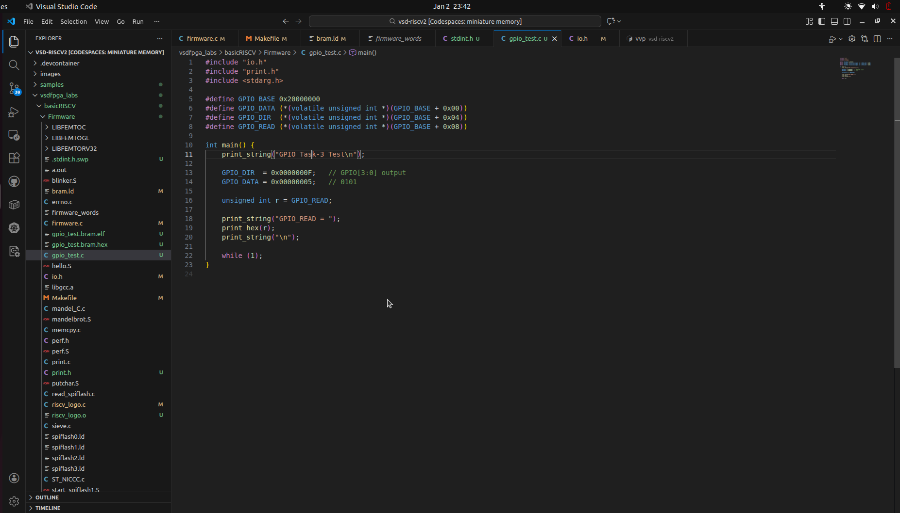
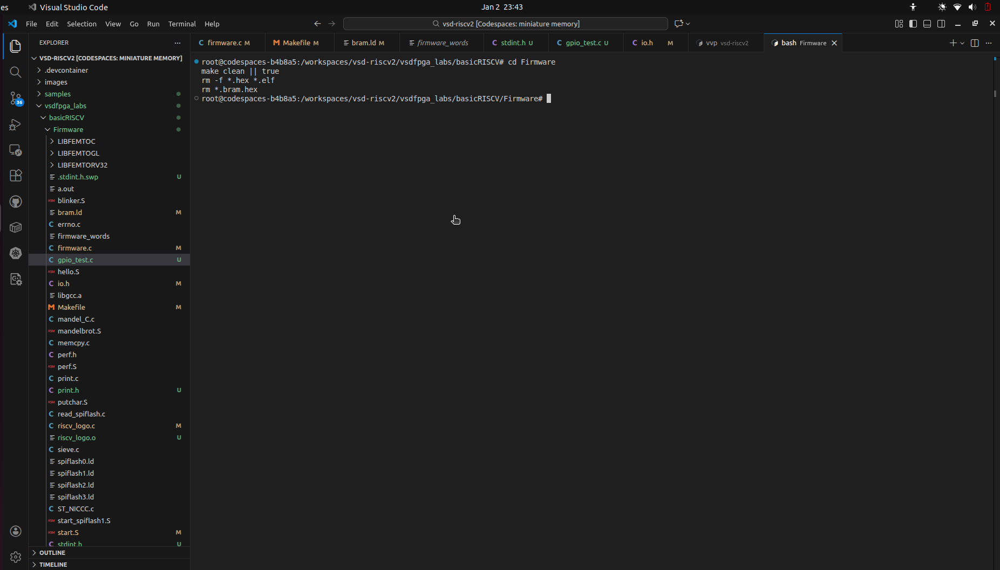
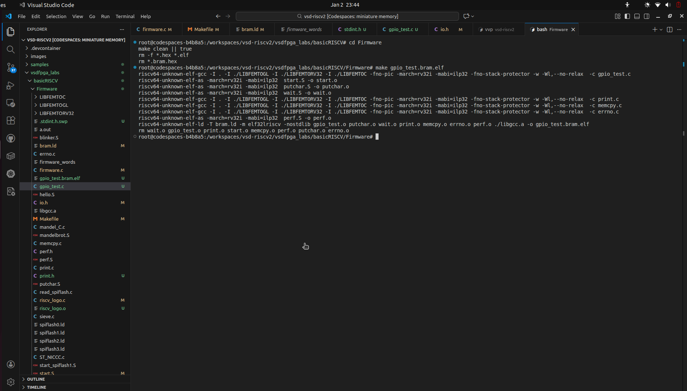
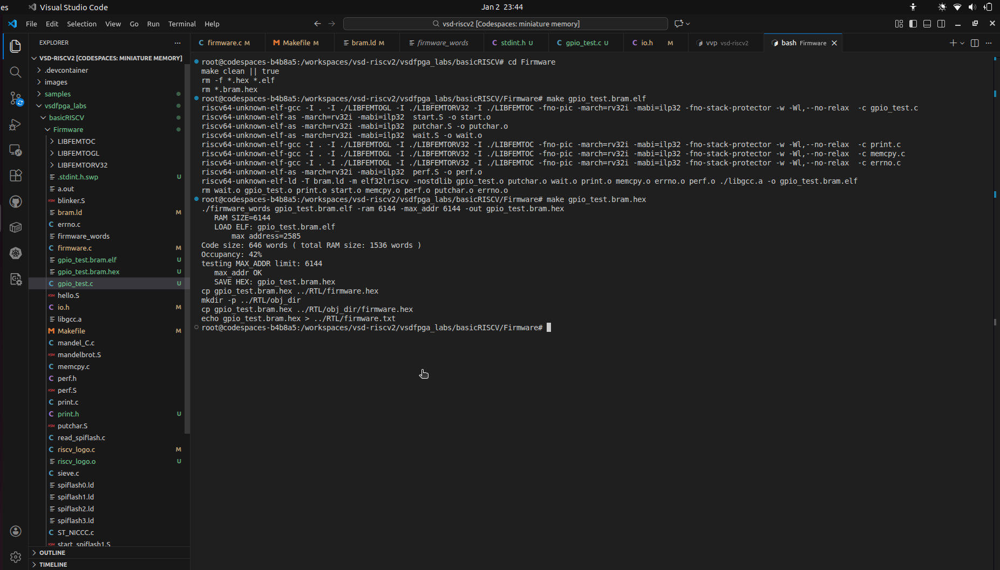
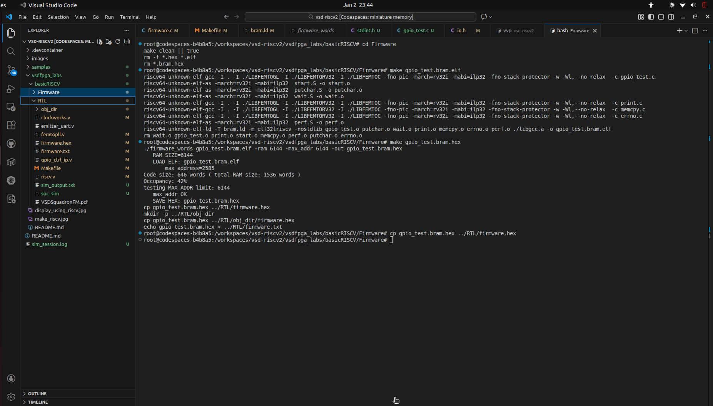
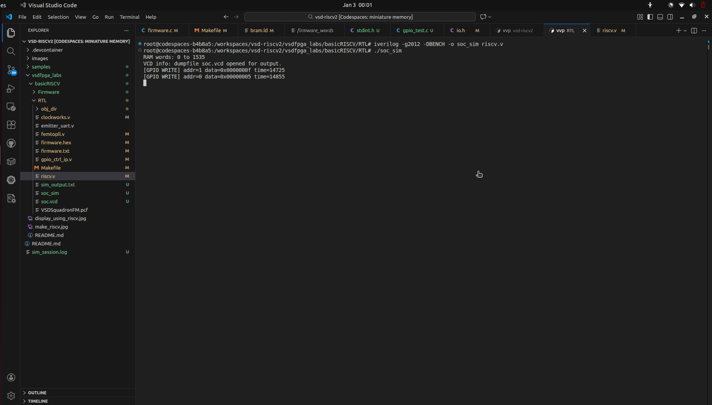
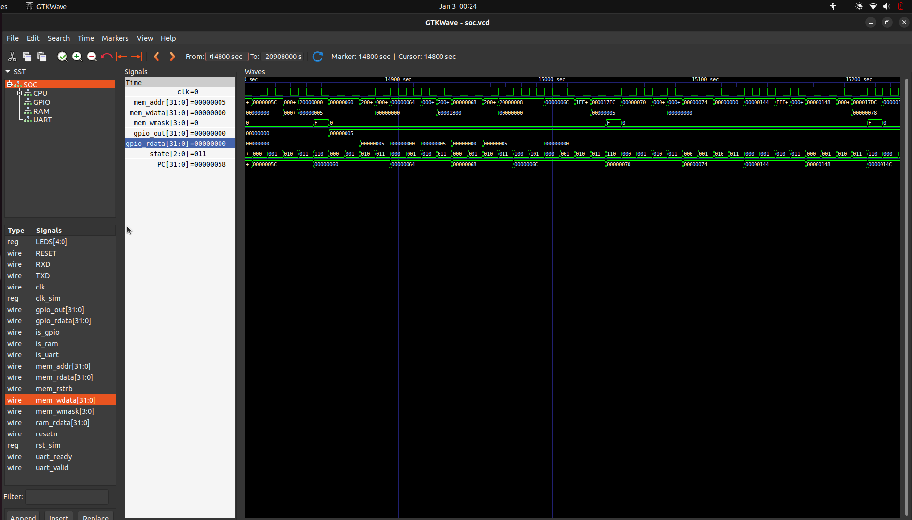

# Task-3: Design a Multi-Register GPIO IP with Software Control

## Overview

In Task-3, I focused on designing and validating a **realistic, software-controlled GPIO peripheral** similar to what I would find in production System-on-Chip (SoC) designs.  I built this task directly on Task-2 by extending a simple GPIO IP into a **multi-register, memory-mapped IP** with proper direction control, readback capability, and clean software–hardware interaction.

My GPIO Control IP is accessed by a RISC-V processor through memory-mapped registers and allows my software to:

* Configure GPIO pin direction (input or output)
* Write output values to GPIO pins
* Read back the current GPIO pin state

I emphasized the following in this task:

* Register-level thinking
* Address offset decoding
* Clean and synthesizable RTL design
* End-to-end validation from C software to hardware signals

I treated FPGA hardware validation as **optional but encouraged**, as I have access to the VSDSquadron FPGA board.

---

## Repository Structure

I ensured the following files and directories were committed to the GitHub repository for Task-3. This structure reflects exactly what I used to achieve the final working output.

```
Task-3/
├── RTL/
│   ├── riscv.v                 # Top-level SoC integration
│   ├── gpio_ctrl_ip.v          # Multi-register GPIO IP (DATA, DIR, READ)
│   ├── clockworks.v            # Clock and reset generation
│   ├── emitter_uart.v          # UART transmitter IP
│   ├── firmware.hex            # Generated firmware image for simulation & hardware
│   ├── VSDSquadronFM.pcf       # FPGA pin constraint file
│   └── Makefile                # Build, flash, and simulation targets
│
├── Firmware/
│   ├── gpio_test.c             # C program to validate GPIO behavior
│   ├── print.c / print.h       # UART print utilities
│   ├── start.S                 # RISC-V startup code
│   ├── bram.ld                 # Linker script for BRAM execution
│   ├── firmware_words          # ELF → HEX conversion utility
│   └── Makefile                # Firmware build and HEX generation
│
└── README.md                   # Task-3 documentation

```

> **Important:**
> I ensured the `firmware.hex` file was committed, as I required it for both simulation and FPGA hardware execution.

---

## Task Breakdown and Navigation

I used the links below to navigate through each step of my Task-3 work:

* [Step 1: Study and Plan](#step-1-study-and-plan-mandatory)
* [Step 2: Implement Multi-Register GPIO RTL](#step-2-implement-multi-register-gpio-rtl-mandatory)
* [Step 3: Integrate the Multi Register GPIO IP into the SoC](#step-3-integrate-the-multi-register-gpio-ip-into-the-soc-mandatory)
* [Step 4: Software Validation](#step-4-software-validation-mandatory)
* [Step 5: Hardware Validation](#step-5-hardware-validation-optional)

---

This overview defines the scope, structure, and navigation of my Task-3.
I built each step below progressively, starting from design planning and ending with optional real-hardware validation.

## Step 1: Study and Plan (Mandatory)

### Purpose of This Step

I focused Step 1 entirely on **analysis and design planning**.
I performed no RTL code, C code, or integration work at this stage.

My objective was to **fully understand what needs to be built and why**, before writing a single line of code. This mirrors real-world hardware development workflows, where I know a poorly planned IP almost always leads to bugs, rework, and unclear software behavior later.

This step establishes the **software–hardware contract** that all my subsequent steps depend on.

---

### Reviewing the Task-2 GPIO IP

My starting point for Task-3 was the GPIO IP I implemented in Task-2.
Before extending it, I reviewed the existing design carefully.

From Task-2, my GPIO IP typically had:

* A single register
* Basic write functionality
* Minimal or no direction control
* Simple address decoding

During this review, I answered the following questions:

* How does the CPU communicate with the GPIO IP?
* How are writes detected (bus signals, write mask)?
* How is data stored and driven to outputs?
* How does the IP return read data?

This review helped me identify:

* Which logic I can reuse
* Which logic I must redesign
* Where I require additional structure

---

### Understanding the New Requirements for Task-3

In Task-3, I was required to upgrade the simple GPIO IP into a **multi-register peripheral**, similar to what is used in real SoCs.

My new GPIO IP must:

* Support **multiple memory-mapped registers**
* Allow **per-pin direction control**
* Provide **readback of GPIO pin state**
* Behave predictably for both software and hardware

This means I can no longer design the IP to behave like a single latch. It must behave like a **register block**.

---

### Defining the Register Map

I defined a fixed register map for the GPIO IP. This register map is the foundation of my entire design.

| Offset | Register Name | Description |
| --- | --- | --- |
| 0x00  | GPIO_DATA      | Stores output values written by software |
| 0x04  | GPIO_DIR      | Controls direction (1 = output, 0 = input) |
| 0x08  | GPIO_READ      | Returns current GPIO pin state |

I made these important design decisions here:

* All registers are **32-bit wide**
* Registers are **word-aligned**
* GPIO_READ is **read-only**
* GPIO_DATA and GPIO_DIR are **read/write**

Once defined, I ensured this register map did not change, as my software depends on it.

---

### Defining Register Behavior (Critical Planning)

I defined each register's behavior precisely before implementation.

#### GPIO_DATA (Offset 0x00)

* Writing updates the stored output value
* Reading returns the **last written value**
* Does not depend on GPIO direction

#### GPIO_DIR (Offset 0x04)

* Each bit controls one GPIO pin
* `1` → output enabled
* `0` → input mode
* Affects both output driving and readback behavior

#### GPIO_READ (Offset 0x08)

* Read-only register
* Returns:
  - Output value for pins configured as outputs
  - External pin state for pins configured as inputs

By defining this behavior early, I prevented ambiguity and inconsistent implementations.

---

### Address Offset Decoding Strategy

My GPIO IP must determine **which register is being accessed** using the address bus.

My planning decisions:

* Base address decoding will be handled at the SoC level
* Inside the GPIO IP, I only require **offset decoding**
* I will use lower address bits (e.g. `bus_addr[3:2]`) to select registers

My planned mapping:

* `00` → GPIO_DATA
* `01` → GPIO_DIR
* `10` → GPIO_READ

I wrote no decoding logic yet, but I clearly defined the mapping.

---

### Internal Signal Planning

Before coding, I planned internal signals and registers to keep the RTL clean and understandable.

My planned internal elements:

* `gpio_data` register for output values
* `gpio_dir` register for direction control
* `gpio_out` signal for driven outputs
* `gpio_in` signal for external inputs
* `gpio_read` signal for readback logic

Each signal has:

* A single responsibility
* Clear ownership (register vs combinational logic)

I did this to prevent latch inference and unintended behavior later.

---

### Reset Behavior Planning

I defined reset behavior at this stage to ensure safe defaults.

On reset:

* GPIO_DATA → `0`
* GPIO_DIR → `0` (all pins input)
* GPIO outputs → inactive

This ensures:

* No pins are driven unintentionally at reset
* My software must explicitly configure GPIOs before use

---

### Software Perspective Considerations

I also required thinking from the **software point of view** during this step.

Key questions I considered:

* What happens if software writes GPIO_DATA before GPIO_DIR?
* What value does GPIO_READ return immediately after reset?
* Are register reads deterministic?

By answering these questions early, my GPIO IP becomes:

* Easier to use from software
* Easier to debug
* Closer to real industry peripherals

---

### Outcome of Step 1

At the end of Step 1:

* I wrote no RTL code
* I defined the full GPIO register map
* I clearly specified register behavior
* I planned the address decoding strategy
* I identified internal signals
* I decided on reset behavior

This step establishes a **solid design foundation**.
Only after completing this planning step did it make sense for me to move to RTL implementation in Step 2.

## Step 2: Implement Multi-Register GPIO RTL (Mandatory)

### Purpose of This Step

Step 2 is where I began the **actual RTL implementation** of the GPIO Control IP.
Using the design decisions I made in Step 1, my goal here was to convert the planned register map and behavior into **clean, synthesizable Verilog RTL**.

I focused only on the **GPIO IP itself** in this step.
I performed no SoC-level integration, no firmware, and no hardware programming here.

---

### File Modified in This Step

I modified only one file in this step:

* `gpio_ctrl_ip.v`

I made this separation intentional and important:

* The GPIO IP should remain **self-contained**
* It should not depend on SoC internals
* It should be reusable in other SoCs

---

### Register Implementation Strategy

Based on my Step 1 planning, I implemented three registers in the GPIO IP:

| Offset | Register | Type |
| --- | --- | --- |
| 0x00  | GPIO_DATA | Read / Write |
| 0x04  | GPIO_DIR  | Read / Write |
| 0x08  | GPIO_READ | Read Only |

I implemented each register either as:

* A **storage register** (`reg`)
* Or a **derived combinational signal**

---

### Internal Registers and Signals

I declared the following internal elements inside `gpio_ctrl_ip.v`:

#### Registers

* `gpio_data`
  Stores the value written by software to `GPIO_DATA`
* `gpio_dir`
  Stores direction bits written to `GPIO_DIR`

#### Wires

* `gpio_read`
  Represents the computed GPIO readback value
* `reg_sel`
  Used for address offset decoding

My clear separation ensures:

* No unintended latches
* Predictable synthesis results
* Easy debugging

---

### Address Offset Decoding

To support multiple registers, I implemented address offset decoding using lower address bits:

```verilog
wire [1:0] reg_sel = bus_addr[3:2];

```

Why this works:

* Registers are 32-bit aligned
* Address offsets increment by 4 bytes
* `bus_addr[3:2]` uniquely selects each register

Mapping:

* `2'b00` → GPIO_DATA (0x00)
* `2'b01` → GPIO_DIR (0x04)
* `2'b10` → GPIO_READ (0x08)

This decoding logic is simple, synthesizable, and commonly used in real designs.

---

### Write Logic Implementation

I handled all write operations synchronously on the rising edge of the clock.

Key design rules I followed:

* No combinational writes
* Explicit reset behavior
* Writes only occur when the IP is selected

#### Write Logic Code

```verilog
always @(posedge clk) begin
    if (!rst_n) begin
        gpio_data <= 32'b0;
        gpio_dir  <= 32'b0;
    end else if (bus_valid && bus_we) begin
        case (reg_sel)
            2'b00: gpio_data <= bus_wdata; // GPIO_DATA
            2'b01: gpio_dir  <= bus_wdata; // GPIO_DIR
            default: ;
        endcase
    end
end

```

#### Behavior Explanation

On reset:

* All GPIOs default to input mode
* Output data is cleared

Writes only affect:

* GPIO_DATA or GPIO_DIR
* Writes to GPIO_READ are ignored

This guarantees predictable and safe behavior.

---

### Read Logic Implementation

I implemented read logic using pure combinational logic.

This ensures:

* Immediate response to CPU reads
* No clock dependency
* No state changes during reads

#### Read Logic Code

```verilog
always @(*) begin
    case (reg_sel)
        2'b00: bus_rdata = gpio_data; // GPIO_DATA
        2'b01: bus_rdata = gpio_dir;  // GPIO_DIR
        2'b10: bus_rdata = gpio_read; // GPIO_READ
        default: bus_rdata = 32'b0;
    endcase
end

```

---

### GPIO Readback Logic (Key Functional Block)

The most critical part of the GPIO IP is the GPIO_READ behavior.

Requirement:

* Output pins → reflect driven output value
* Input pins → reflect external pin state

#### Implementation

```verilog
assign gpio_read = (gpio_dir & gpio_data) | (~gpio_dir & gpio_in);

```

Explanation:

* `gpio_dir` acts as a mask
* Output pins select `gpio_data`
* Input pins select `gpio_in`
* Supports mixed input/output operation per pin

This exactly matches real-world GPIO peripherals.

---

### Driving GPIO Outputs

GPIO outputs must only drive pins configured as outputs.

```verilog
assign gpio_out = gpio_data & gpio_dir;

```

This prevents:

* Driving pins configured as inputs
* Electrical contention
* Undefined hardware behavior

---

### Reset Behavior

My reset behavior is explicit and safe:

* GPIO_DATA → 0
* GPIO_DIR → 0
* All pins default to input mode

This ensures the system powers up in a safe state.

---

### What I did NOT do in Step 2

To avoid confusion, note that in this step:

 I did no SoC integration
 I added no address base decoding
 I wrote no C firmware
 I performed no simulation or hardware validation

This step is strictly RTL IP implementation.

---

### Evidence to Include for Step 2


`gpio_ctrl_ip.v` showing:

* Register declarations
* Address decoding logic
* Write always block
* Read combinational block
* GPIO readback logic

These screenshots prove correct RTL design, not functionality.

---

### Outcome of Step 2

At the end of Step 2:

* I implemented a clean, multi-register GPIO IP
* Register map behavior matches the specification
* RTL is synthesizable and reusable
* The IP is ready for SoC integration in Step 3

This step transforms the GPIO from a simple block into a realistic peripheral.

## Step 3: Integrate the Multi Register GPIO IP into the SoC (Mandatory)

### Purpose of This Step

In Step 3, I focused on **integrating the multi-register GPIO IP into the existing RISC-V SoC**.
At this stage, the GPIO IP is already complete and correct in isolation (from Step 2). My goal now was to make it **accessible to software** by connecting it to the SoC bus and assigning it a **memory-mapped address range**.

This step is critical because:

* Even a perfectly designed IP will not work if I integrate it incorrectly
* Most real-world bugs appear during SoC integration, not IP design
* Address decoding and bus routing must be exact

---

### Files Modified in This Step

I modified only **one file** in this step:

* `riscv.v` (specifically the `SOC` module)

I **did not modify** the following files:

* `gpio_ctrl_ip.v`
* Firmware files
* Build scripts

My strict separation ensures:

* IP remains reusable
* Integration logic remains SoC-specific

---

### Understanding the SoC Bus Interface

The RISC-V processor communicates with peripherals using a simple memory-mapped bus consisting of:

* `mem_addr`  → Address issued by CPU
* `mem_rdata` → Read data returned to CPU
* `mem_rstrb` → Read strobe
* `mem_wdata` → Write data
* `mem_wmask` → Write mask (byte enables)

Every peripheral (RAM, GPIO, UART) must:

* Respond only to its own address range
* Drive `mem_rdata` only when selected
* Ignore accesses meant for other devices

---

### Assigning the GPIO Base Address

I assigned a fixed base address to the GPIO IP inside the `SOC` module:

```verilog
localparam GPIO_BASE = 32'h2000_0000;

```

Why this matters:

* Software uses this base address to access GPIO registers
* Address must not overlap with RAM or UART
* Clean separation simplifies debugging and future expansion

---

### Address Map of the SoC

After integration, the SoC address space looks like this:

| Address Range | Device |
| --- | --- |
| 0x0000_0000 – … | RAM |
| 0x2000_0000 – … | GPIO |
| 0x4000_0000 – … | UART |

Only the upper address bits are used for decoding.

---

### Address Decoding Logic

Inside the SOC module, I implemented address decoding as:

```verilog
wire is_uart = (mem_addr[31:12] == UART_BASE[31:12]);
wire is_gpio = (mem_addr[31:12] == GPIO_BASE[31:12]);
wire is_ram  = ~(is_uart | is_gpio);

```

Why this logic is important:

* Ensures only one device responds to a given access
* Prevents bus contention
* Fixes instruction fetch issues (X-PC problem)

 The `is_ram` signal is especially important.
Without it, the CPU may try to fetch instructions from GPIO or UART space.

---

### Instantiating the GPIO IP

I instantiated the GPIO IP and connected it to the SoC bus:

```verilog
gpio_ctrl_ip GPIO (
    .clk        (clk),
    .rst_n      (resetn),

    .bus_valid  (is_gpio & (mem_rstrb | |mem_wmask)),
    .bus_we     (|mem_wmask),
    .bus_addr   (mem_addr),
    .bus_wdata  (mem_wdata),
    .bus_rdata  (gpio_rdata),

    .gpio_in    (32'b0),
    .gpio_out   (gpio_out)
);

```

Signal explanation:

#### `bus_valid`

Ensures GPIO responds only when selected and accessed

#### `bus_we`

Derived from write mask

#### `bus_addr`

Full address passed; GPIO IP decodes offsets internally

#### `gpio_in`

Tied to zero for now (external pins optional)

#### `gpio_out`

Used to drive LEDs or GPIO pins

---

### Connecting GPIO Outputs to LEDs

To make GPIO activity visible, I connected GPIO outputs to board LEDs:

```verilog
always @(posedge clk)
    LEDS <= resetn ? gpio_out[4:0] : 5'b0;

```

This allows:

* Immediate visual validation
* Debugging without tools
* Hardware validation in Step 5

---

### Read Data Multiplexing (Critical Section)

Only one device must drive `mem_rdata` at any time.

```verilog
assign mem_rdata =
    is_ram  ? ram_rdata  :
    is_gpio ? gpio_rdata :
    (mem_addr == UART_CTL) ? {22'b0, !uart_ready, 9'b0} :
    32'b0;

```

Why this is critical:

* Prevents multiple drivers on `mem_rdata`
* Guarantees correct readback
* Avoids undefined CPU behavior

This is one of the most common integration mistakes, and fixing it is essential.

---

### Optional Simulation Debug Output

For simulation-only debugging, I logged GPIO writes:

```verilog
always @(posedge clk) begin
    if (is_gpio && |mem_wmask) begin
        `ifndef SYNTHESIS
        $display(
            "[GPIO WRITE] addr=%0d data=0x%08x time=%0t",
            mem_addr[3:2],
            mem_wdata,
            $time
        );
        `endif
    end
end

```

Purpose:

* Confirms address offsets
* Confirms write values
* Helps validate Step 4 software behavior

These statements are ignored during synthesis.

---

### What I did NOT do in Step 3

To avoid confusion:

I made no GPIO RTL changes
 I performed no firmware compilation
 I generated no HEX
 I did no FPGA programming

This step is strictly SoC-level integration.

---

### Evidence to Include for Step 3


SOC module showing:

* GPIO base address definition
* Address decoding logic
* GPIO IP instantiation
* `mem_rdata` multiplexer
* LED connection logic

These screenshots prove correct integration, not functionality.

---

### Outcome of Step 3

At the end of Step 3:

* GPIO IP is memory-mapped into the SoC
* CPU can safely access GPIO registers
* Address decoding is correct and conflict-free
* The design is ready for software validation in Step 4

This step completes the hardware-side plumbing required for end-to-end validation.

---

## Step 4: Software Validation (Mandatory)

### Purpose of This Step

The purpose of Step 4 is to **validate the multi-register GPIO IP through real software execution** on the RISC-V processor.
This step proves that the GPIO hardware behaves correctly when accessed using **memory-mapped I/O** by a C program, not just in isolation at the RTL level.

Up to Step 3:

* The GPIO IP was correctly designed
* It was integrated into the SoC
* Address decoding was verified at the RTL level

However, a peripheral is only correct if **software can use it reliably**.
This step establishes and validates the complete flow:

```
C Software → CPU → Bus → GPIO IP → Registers → Signals
```

Simulation-based validation is **mandatory** for this task.

---

### What Is Being Validated

Using software execution, the following behaviors are verified:

* GPIO direction control using `GPIO_DIR`
* GPIO output updates using `GPIO_DATA`
* GPIO readback behavior using `GPIO_READ`
* Correct address offset decoding
* Correct timing and ordering of read/write transactions
* Proper execution flow confirmed via UART and simulation logs
* Signal-level correctness using GTKWave

---

### Files Used in This Step

#### Firmware Side

* `Firmware/gpio_test.c` – GPIO test application
* `Firmware/start.S` – startup code
* `Firmware/print.c` – UART print support
* `Firmware/bram.ld` – linker script

#### RTL Side

* `RTL/riscv.v`
* `RTL/firmware.hex` (generated during this step)

No RTL logic was modified during Step 4.

---

## Step 4.1: Writing the GPIO Test Program

A C program was written to explicitly exercise all GPIO registers and validate their behavior from software.

### Key Actions Performed by the Firmware

* Define the GPIO base address
* Configure GPIO direction using `GPIO_DIR`
* Write a known pattern to `GPIO_DATA`
* Read back GPIO state using `GPIO_READ`
* Print values over UART for confirmation

### Register Definitions Used in C

```c
#define GPIO_BASE  0x20000000
#define GPIO_DATA  (*(volatile unsigned int *)(GPIO_BASE + 0x00))
#define GPIO_DIR   (*(volatile unsigned int *)(GPIO_BASE + 0x04))
#define GPIO_READ  (*(volatile unsigned int *)(GPIO_BASE + 0x08))
```

### Example Test Sequence

```c
GPIO_DIR  = 0x0F;   // Configure lower 4 GPIO pins as outputs
GPIO_DATA = 0x05;   // Drive pattern 0101
unsigned int val = GPIO_READ;
print_hex(val);
```

This directly matches the register behavior defined during design.

#### Screenshot



---

## Step 4.2: Cleaning Previous Firmware Builds

Before building new firmware, all previous build artifacts were removed to avoid using stale binaries.

### Commands Used

```bash
cd Firmware
make clean || true
rm -f *.hex *.elf
```

This ensures the generated HEX file always corresponds to the current firmware source.

#### Screenshot



---

## Step 4.3: Compiling the Firmware (ELF Generation)

The firmware was compiled and linked for execution from BRAM.

### Command Used

```bash
make gpio_test.bram.elf
```

This step performs:

* C compilation using the RISC-V toolchain
* Assembly of startup code
* Linking using `bram.ld`

### Output File

* `gpio_test.bram.elf`

#### Screenshot



---

## Step 4.4: Generating the BRAM HEX File (Critical Step)

The ELF file must be converted into a word-addressable HEX file that the RTL memory model can load.

### Command Used

```bash
make gpio_test.bram.hex
```

Internally, this runs a conversion similar to:

```bash
./firmware_words gpio_test.bram.elf -ram 6144 -max_addr 6144 -out gpio_test.bram.hex
```

### Why This Step Is Critical

* `$readmemh()` loads HEX files, not ELF files
* Memory size must match the RTL BRAM
* Skipping this step results in invalid instruction execution

### Output File

* `gpio_test.bram.hex`

#### Screenshot



---

## Step 4.5: Copying the HEX File to the RTL Directory

The generated HEX file was copied to the RTL directory where the memory model expects it.

### Command Used

```bash
cp gpio_test.bram.hex ../RTL/firmware.hex
```

The RTL loads this file using:

```verilog
initial begin
    $readmemh("firmware.hex", MEM);
end
```

#### Screenshot

```md

```

---

## Step 4.6: Running the Full SoC Simulation

The complete SoC was simulated with the firmware executing on the RISC-V core.

### Commands Used

```bash
cd ../RTL
iverilog -g2012 -DBENCH -o soc_sim riscv.v
./soc_sim
```

During simulation:

* The CPU fetches instructions from BRAM
* Firmware executes automatically
* GPIO registers are accessed by software
* Debug messages confirm register writes

#### Screenshot



---

## Step 4.7: Observing Simulation Logs

Typical simulation output includes:

```
RAM words: 0 to 1535
[GPIO WRITE] addr=1 data=0x0000000f time=14725
[GPIO WRITE] addr=0 data=0x00000005 time=14855
```

Interpretation:

* `addr = 1` → GPIO_DIR (offset `0x04`)
* `addr = 0` → GPIO_DATA (offset `0x00`)
* Data values match firmware writes

This confirms correct address decoding and register behavior.

---

## Step 4.8: GTKWave Signal-Level Validation

To validate behavior at the signal level, GTKWave was used to inspect the generated waveform.

### Steps Performed

* VCD file generated during simulation
* GTKWave opened using `soc.vcd`
* Key signals observed:

  * `PC`
  * `state`
  * `mem_addr`
  * `mem_wdata`
  * `mem_wmask`
  * `gpio_out`
  * `gpio_rdata`

### What Was Verified

* `PC` increments correctly and matches instruction flow
* FSM `state` transitions correctly
* GPIO writes occur at correct addresses
* `gpio_out` reflects values written by software
* `gpio_rdata` matches expected readback

#### Screenshot



---

## Step 4.9: Handling Output Differences

Minor differences in simulation output are acceptable:

* Timing values may differ
* Order of debug prints may vary

As long as:

* `GPIO_DIR` is written before `GPIO_DATA`
* Written data matches firmware intent
* Readback values are correct

The validation is considered successful.

---

## Outcome of Step 4

By completing this step:

* GPIO IP is proven usable from software
* Register map behaves exactly as designed
* Address decoding is correct
* Software–hardware contract is fully validated
* The design is ready for FPGA hardware validation (Step 5)

This completes functional verification of the GPIO Control IP.

---

## Step 5: Hardware Validation (Optional)

### Purpose of This Step

In Step 5, I validated the **entire GPIO subsystem on real FPGA hardware**, confirming that everything developed and verified in simulation (Steps 1–4) works correctly when deployed on the VSDSquadron FPGA board.

While this step is optional, it is extremely valuable because it demonstrates:

* End-to-end correctness (software → CPU → bus → GPIO IP → physical pins)
* Real-world timing behavior
* Practical FPGA bring-up and debugging skills

This step mirrors how IPs are validated in industry after simulation sign-off.

---

## What Is Being Validated on Hardware

By running this step, I validate:

1. The synthesized SoC fits and routes correctly on the FPGA
2. The RISC-V core boots and executes firmware from BRAM
3. The GPIO IP responds to memory-mapped accesses
4. GPIO direction control works physically
5. GPIO output values drive real LEDs
6. The same firmware used in simulation runs unmodified on hardware

---

## Prerequisites Before Starting Step 5

Before attempting hardware validation, I ensured:

* Step 2: GPIO IP RTL is complete and correct
* Step 3: GPIO IP is integrated into the SoC
* Step 4: Firmware runs successfully in simulation
* `firmware.hex` is present in the `RTL/` directory
* `make build` completes without errors
* FPGA board and USB cable are available

---

## Step 5.1: Building the FPGA Bitstream

From the `RTL` directory, I generated the FPGA bitstream:

```bash
make clean
make build

```

### What Happens Internally

This command performs the full FPGA flow:

1. **Yosys**

   * Synthesizes Verilog RTL
   * Generates a technology-mapped netlist (`SOC.json`)

2. **nextpnr-ice40**

   * Places and routes the design
   * Applies pin constraints from `.pcf`
   * Optimizes timing

3. **icetime**

   * Performs static timing analysis

4. **icepack**

   * Produces the final bitstream (`SOC.bin`)

### Expected Outcome

* No synthesis or P&R errors
* `SOC.bin` file generated successfully
* Terminal output showing successful completion of `make build`

---

## Step 5.2: Connecting the FPGA Board

I connected the VSDSquadron FPGA board to the system using a USB cable.

I verified that the board is detected:

```bash
lsusb

```

I should see an FTDI device similar to:

```
Future Technology Devices International, Ltd FT232H

```

I verified FTDI drivers are loaded:

```bash
lsmod | grep ftdi

```

This confirms the system can communicate with the board.

---

## Step 5.3: Flashing the Bitstream to the FPGA

I programmed the FPGA with the generated bitstream:

```bash
sudo iceprog SOC.bin

```

### Expected Output

Typical successful output looks like:

```
flash ID: 0xEF 0x40 0x16 0x00
programming..
VERIFY OK
cdone: high

```

This confirms:

* Flash memory is detected
* Bitstream is written correctly
* FPGA configuration is successful
* Terminal output showing successful `iceprog`

---

## Step 5.4: Firmware Execution on Hardware

After flashing:

* The FPGA automatically comes out of reset
* The RISC-V CPU starts executing the firmware from BRAM
* No additional action is required

The firmware performs the same sequence as in simulation:

1. Writes to `GPIO_DIR`
2. Writes to `GPIO_DATA`
3. Optionally reads `GPIO_READ`

---

## Step 5.5: Observing GPIO Behavior on LEDs

GPIO outputs are connected to physical LEDs on the board.

Expected behavior:

* LEDs corresponding to output-enabled GPIO pins turn ON/OFF
* LED pattern matches the value written in firmware
* Pins configured as inputs do not drive LEDs

This confirms:

* Direction control is working
* Output data is correctly driven
* Software-to-hardware path is functional

---

## Step 5.6: Optional UART Output Validation

If UART output is enabled in the firmware:

I opened the serial terminal:

```bash
picocom -b 9600 /dev/ttyUSBx

```

If the firmware prints messages, they should appear in the terminal, confirming UART and CPU execution on hardware.

---

## Common Issues and Debug Notes

* **No LEDs ON**

  * Check `GPIO_DIR` is set correctly in firmware
  * Verify LED pin mapping in `.pcf`

* **Board not detected**

  * Try a different USB port
  * Check FTDI drivers
  * Use `sudo` for flashing

* **UART not opening**

  * Confirm correct `/dev/ttyUSBx`
  * Ensure baud rate matches firmware

These are normal bring-up issues and part of real hardware validation.

---

## Outcome of Step 5

By completing Step 5, I have demonstrated:

* A fully working RISC-V SoC on FPGA
* A production-style GPIO IP with direction and data registers
* Successful software control of hardware peripherals
* End-to-end validation beyond simulation

This confirmed that my GPIO IP is **hardware-ready** and suitable as a foundation for more advanced peripherals.

---

## Final Note

Although optional, completing this step provides strong evidence of:

* Practical FPGA skills
* Real SoC integration experience
* Industry-relevant validation workflow

This concludes Task-3 successfully.
