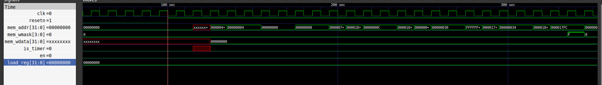
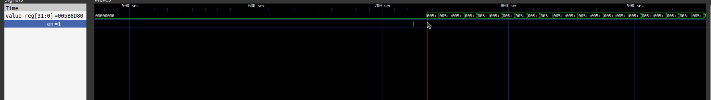
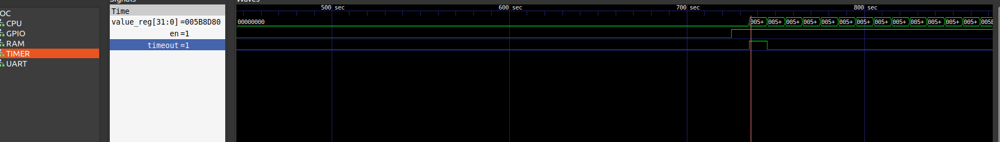
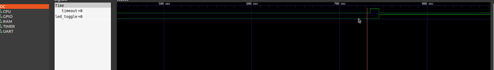
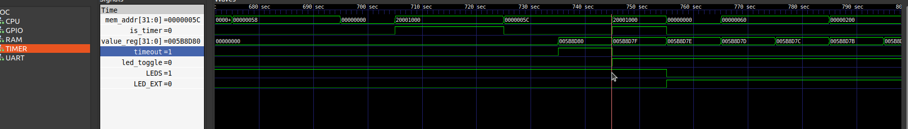

# Timer IP – VSDSquadron FPGA

## IP Overview
The Timer IP is a memory-mapped, programmable countdown timer designed for use in
VSDSquadron FPGA–based systems. It enables software running on the RISC-V processor
to configure time-based events, while the timing operation itself is performed
entirely in hardware.

This IP is intended for applications such as delays, periodic events, and
hardware-driven heartbeat indicators.

---

## Features
- 32-bit programmable countdown timer  
- Memory-mapped register interface  
- One-shot and periodic operating modes  
- Sticky timeout status with Write-1-to-Clear (W1C) behavior  
- Software polling–based control model  
- Verified on VSDSquadron FPGA hardware  

---

## Repository Structure
```
ip/timer_ip/
├── rtl/                # Timer IP RTL implementation
├── software/           # Example software
├── docs/               # Detailed documentation
└── README.md           # This file
```
## Documentation
The complete documentation for this IP is available in the `docs/` directory:

- [IP User Guide](docs/IP_User_Guide.md)  
- [Register Map](docs/Register_Map.md)  
- [Integration Guide](docs/Integration_Guide.md)  
- [Example Usage](docs/Example_Usage.md)  

---

## Quick Start
1. Integrate `timer_ip.v` into the SoC design.
2. Assign a base address for the Timer IP in the system memory map.
3. Build and program the FPGA bitstream.
4. Run the provided software example to configure the timer.
5. Observe hardware behavior driven by the timer timeout signal.

---

## Hardware Demonstration

### Simulation Screenshots

The following screenshots were captured for submission:

1. CPU writing to Timer registers
   

2. Timer countdown (`value_reg` changing)
   

3. Timeout pulse assertion
   

4. LED toggle driven by timeout
   

5. Combined view showing full data path
    


https://github.com/user-attachments/assets/458be707-29d0-4556-9c63-b0ed57ddd98b

---

## Validation Summary
- RTL simulation performed using GTKWave  
- Software register access verified  
- Hardware validation performed on VSDSquadron FPGA  

---

## Known Limitations
- No interrupt output; software must poll the STATUS register  
- Single timer instance  
- Timer resolution depends on the system clock frequency  

---

## License
This IP is provided for educational and open-source use within the VSDSquadron FPGA
ecosystem.
